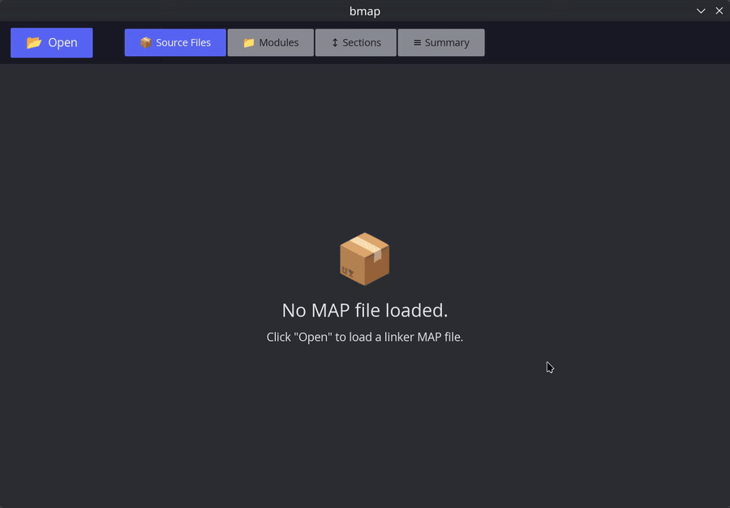

# bmap

A fast, native GUI for inspecting linker MAP files. Built with [GPUI](https://github.com/zed-industries/zed/tree/main/crates/gpui).

Load a `.map` file produced by GNU ld, Clang LLD, or Metrowerks, and explore your binary's memory layout through sortable tables and drill-down views.

<p align="center">
  
</p>

## Features

- **Source Files** — grouped by source file with archive module, searchable
- **Modules** — grouped by `.a` archive file, searchable
- **Sections** — consolidated section categories (.text, .data, .rodata, .bss) expandable to sub-types
- **Drill-down** — click any row to see individual symbols with size, address, and percentage
- **Debug symbols filter** — toggle to show/hide debug sections (.debug_*, .comment, .note, .ARM.*)
- **Summary** — total size and breakdown by Code, Data, BSS, and Other
- **System library filter** — automatically excludes symbols from libc, libm, libgcc, etc.
- **Internationalization** — English and Russian translations

## Usage

```
cargo run --release
```

Then click **Open** and select a `.map` file.

## Build

```
cargo build --release
```

The binary will be at `target/release/bmap`.

## Project layout

```
src/
├── app.rs          # Root GPUI entity, state, and update loop
├── i18n.rs         # Compile-time English/Russian translations
├── main.rs         # Application entry point
├── model.rs        # MAP parsing and pure grouping functions
├── theme.rs        # Color constants
└── ui/
    ├── empty.rs    # Empty / error state
    ├── input.rs    # Minimal focusable search input
    ├── pages.rs    # Source files, modules, sections, summary, symbols
    ├── table.rs    # Table header/cell helpers
    └── toolbar.rs  # Open button, page tabs, search, debug toggle
```

## License

MIT
